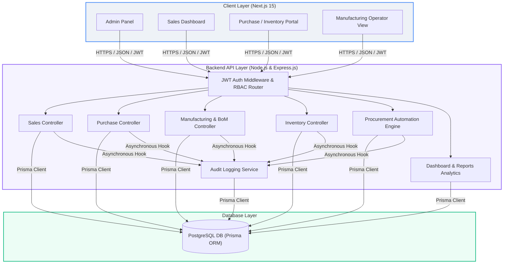

# Shiv Furniture Works Mini ERP System - Updated Design & Architecture Plan

This document outlines the system architecture, updated database ERD, optimized Prisma schema, folder structure, API design, database indexing strategy, and database migration strategy.

---

## Complete System Architecture

The Mini ERP system uses a decoupled client-server architecture. It features a responsive Next.js 15 client communicating with a stateless Express.js REST API backend connected to a PostgreSQL database.



---

## Database ERD (Updated)

```mermaid
erDiagram
    User ||--o{ RefreshToken : has
    User ||--o{ StockLedger : creates
    User ||--o{ AuditLog : generates
    User ||--o{ ManufacturingOrder : assigned_to

    Customer ||--o{ SalesOrder : places
    Vendor ||--o{ Product : supplies
    Vendor ||--o{ PurchaseOrder : receives

    ProductCategory ||--o{ Product : categorizes
    UnitOfMeasure ||--o{ Product : measures

    Warehouse ||--o{ Inventory : stores
    Warehouse ||--o{ StockLedger : tracks_in
    Warehouse ||--o{ SalesOrderItem : delivers_from
    Warehouse ||--o{ PurchaseOrderItem : receives_to
    Warehouse ||--o{ ManufacturingOrder : completed_in

    Product ||--o{ Inventory : tracks
    Product ||--o{ SalesOrderItem : included_in
    Product ||--o{ PurchaseOrderItem : included_in
    Product ||--o{ BoM : has_bom
    Product ||--o{ BoMComponent : component_of
    Product ||--o{ StockLedger : moves
    Product ||--o{ ManufacturingOrder : manufactured_as
    Product ||--o{ ProcurementRequest : triggers

    SalesOrder ||--o{ SalesOrderItem : contains
    SalesOrder ||--o{ StockLedger : references
    SalesOrder ||--o{ ProcurementRequest : generates

    PurchaseOrder ||--o{ PurchaseOrderItem : contains
    PurchaseOrder ||--o{ StockLedger : references
    PurchaseOrder ||--o{ ProcurementRequest : associated_with

    ManufacturingOrder ||--o{ WorkOrder : contains
    ManufacturingOrder ||--o{ StockLedger : references
    ManufacturingOrder ||--o{ ProcurementRequest : associated_with

    BoM ||--o{ BoMComponent : contains
    BoM ||--o{ BoMOperation : defines
    BoM ||--o{ ManufacturingOrder : guides

    User {
        string id PK
        string email UK
        string passwordHash
        string firstName
        string lastName
        enumRole role
        boolean active
        datetime createdAt
        datetime updatedAt
    }

    RefreshToken {
        string id PK
        string token UK
        string userId FK
        datetime expiresAt
        boolean revoked
        datetime createdAt
    }

    ProductCategory {
        string id PK
        string name
        string code UK
        string description
        boolean active
        datetime deletedAt "Nullable"
        datetime createdAt
        datetime updatedAt
    }

    UnitOfMeasure {
        string id PK
        string name
        string code UK
        boolean active
        datetime deletedAt "Nullable"
        datetime createdAt
        datetime updatedAt
    }

    Warehouse {
        string id PK
        string name
        string code UK
        string address
        boolean active
        datetime deletedAt "Nullable"
        datetime createdAt
        datetime updatedAt
    }

    Product {
        string id PK
        string sku UK
        string name
        string description
        decimal salesPrice
        decimal costPrice
        string categoryId FK
        string uomId FK
        enumProcurementStrategy procurementStrategy
        enumProcurementType procurementType
        string vendorId FK "Nullable"
        boolean active
        datetime deletedAt "Nullable"
        datetime createdAt
        datetime updatedAt
    }

    Inventory {
        string id PK
        string productId FK "Composite Unique"
        string warehouseId FK "Composite Unique"
        decimal onHand
        decimal reserved
        datetime createdAt
        datetime updatedAt
    }

    Vendor {
        string id PK
        string name
        string contactName
        string email
        string phone
        string address
        boolean active
        datetime deletedAt "Nullable"
        datetime createdAt
        datetime updatedAt
    }

    Customer {
        string id PK
        string name
        string email
        string phone
        string address
        boolean active
        datetime deletedAt "Nullable"
        datetime createdAt
        datetime updatedAt
    }

    SalesOrder {
        string id PK
        string orderNumber UK
        string customerId FK
        enumSalesOrderStatus status
        datetime orderDate
        decimal totalAmount
        datetime createdAt
        datetime updatedAt
    }

    SalesOrderItem {
        string id PK
        string salesOrderId FK
        string productId FK
        string warehouseId FK
        decimal quantity
        decimal unitPrice
        decimal totalCost
        decimal deliveredQuantity
        datetime createdAt
    }

    PurchaseOrder {
        string id PK
        string orderNumber UK
        string vendorId FK
        enumPurchaseOrderStatus status
        datetime orderDate
        decimal totalAmount
        string parentProcurementId FK "Nullable"
        datetime createdAt
        datetime updatedAt
    }

    PurchaseOrderItem {
        string id PK
        string purchaseOrderId FK
        string productId FK
        string warehouseId FK
        decimal quantity
        decimal unitPrice
        decimal totalCost
        decimal receivedQuantity
        datetime createdAt
    }

    BoM {
        string id PK
        string productId FK "Unique"
        string name
        string version
        boolean active
        datetime deletedAt "Nullable"
        datetime createdAt
        datetime updatedAt
    }

    BoMComponent {
        string id PK
        string bomId FK
        string productId FK
        decimal quantity
        datetime createdAt
    }

    BoMOperation {
        string id PK
        string bomId FK
        string name
        enumWorkCenter workCenter
        integer sequence
        string description
        integer durationMinutes
        datetime createdAt
    }

    ManufacturingOrder {
        string id PK
        string moNumber UK
        string productId FK
        decimal quantity
        string bomId FK
        string warehouseId FK
        string assigneeId FK "Nullable"
        enumManufacturingOrderStatus status
        string parentProcurementId FK "Nullable"
        datetime createdAt
        datetime updatedAt
    }

    WorkOrder {
        string id PK
        string woNumber UK
        string manufacturingOrderId FK
        string name
        enumWorkCenter workCenter
        enumWorkOrderStatus status
        integer sequence
        integer durationMinutes
        datetime createdAt
    }

    ProcurementRequest {
        string id PK
        string salesOrderId FK "Nullable"
        string productId FK
        decimal shortageQuantity
        enumProcurementType procurementType
        enumProcurementRequestStatus status
        datetime createdAt
    }

    StockLedger {
        string id PK
        string productId FK
        string warehouseId FK
        decimal quantity
        enumStockMovementType movementType
        string reference
        string userId FK
        datetime createdAt
    }

    AuditLog {
        string id PK
        string userId FK
        string action
        string module
        string oldValue
        string newValue
        string referenceId
        datetime timestamp
    }
```



---

## Prisma Schema (Updated)

```prisma
datasource db {
  provider = "postgresql"
  url      = env("DATABASE_URL")
}

generator client {
  provider = "prisma-client-js"
}

enum Role {
  ADMIN
  SALES_USER
  PURCHASE_USER
  MANUFACTURING_USER
  INVENTORY_MANAGER
  BUSINESS_OWNER
}

enum ProcurementStrategy {
  MTS // Make to Stock
  MTO // Make to Order
}

enum ProcurementType {
  PURCHASE
  MANUFACTURING
}

enum SalesOrderStatus {
  DRAFT
  CONFIRMED
  PARTIALLY_DELIVERED
  FULLY_DELIVERED
  CANCELLED
}

enum PurchaseOrderStatus {
  DRAFT
  CONFIRMED
  PARTIALLY_RECEIVED
  FULLY_RECEIVED
  CANCELLED
}

enum ManufacturingOrderStatus {
  DRAFT
  CONFIRMED
  IN_PROGRESS
  COMPLETED
  CANCELLED
}

enum WorkOrderStatus {
  PENDING
  IN_PROGRESS
  COMPLETED
  CANCELLED
}

enum WorkCenter {
  ASSEMBLY_LINE
  PAINT_FLOOR
  PACKAGING_UNIT
}

enum ProcurementRequestStatus {
  PENDING
  PROCESSED
  FAILED
}

enum StockMovementType {
  PURCHASE_IN
  SALES_OUT
  MANUFACTURING_CONSUMPTION
  MANUFACTURING_PRODUCTION
  INVENTORY_ADJUSTMENT
}

model User {
  id                  String               @id @default(uuid())
  email               String               @unique
  passwordHash        String
  firstName           String
  lastName            String
  role                Role
  active              Boolean              @default(true)
  createdAt           DateTime             @default(now())
  updatedAt           DateTime             @updatedAt
  refreshTokens       RefreshToken[]
  stockLedgers        StockLedger[]
  auditLogs           AuditLog[]
  manufacturingOrders ManufacturingOrder[]

  @@map("users")
}

model RefreshToken {
  id        String   @id @default(uuid())
  token     String   @unique
  userId    String
  user      User     @relation(fields: [userId], references: [id], onDelete: Cascade)
  expiresAt DateTime
  revoked   Boolean  @default(false)
  createdAt DateTime @default(now())

  @@map("refresh_tokens")
}

model ProductCategory {
  id          String    @id @default(uuid())
  name        String
  code        String    @unique
  description String?
  active      Boolean   @default(true)
  deletedAt   DateTime?
  createdAt   DateTime  @default(now())
  updatedAt   DateTime  @updatedAt
  products    Product[]

  @@index([active])
  @@map("product_categories")
}

model UnitOfMeasure {
  id        String    @id @default(uuid())
  name      String
  code      String    @unique
  active    Boolean   @default(true)
  deletedAt DateTime?
  createdAt DateTime  @default(now())
  updatedAt DateTime  @updatedAt
  products  Product[]

  @@index([active])
  @@map("units_of_measure")
}

model Warehouse {
  id                 String               @id @default(uuid())
  name               String
  code               String               @unique
  address            String?
  active             Boolean              @default(true)
  deletedAt          DateTime?
  createdAt          DateTime             @default(now())
  updatedAt          DateTime             @updatedAt
  inventories        Inventory[]
  stockLedgers       StockLedger[]
  salesOrderItems    SalesOrderItem[]
  purchaseOrderItems PurchaseOrderItem[]
  manufacturingOrders ManufacturingOrder[]

  @@index([active])
  @@map("warehouses")
}

model Product {
  id                  String               @id @default(uuid())
  sku                 String               @unique
  name                String
  description         String?
  salesPrice          Decimal              @db.Decimal(12, 2)
  costPrice           Decimal              @db.Decimal(12, 2)
  categoryId          String
  category            ProductCategory      @relation(fields: [categoryId], references: [id])
  uomId               String
  uom                 UnitOfMeasure        @relation(fields: [uomId], references: [id])
  procurementStrategy ProcurementStrategy
  procurementType     ProcurementType
  vendorId            String?
  vendor              Vendor?              @relation(fields: [vendorId], references: [id], onDelete: SetNull)
  active              Boolean              @default(true)
  deletedAt           DateTime?
  createdAt           DateTime             @default(now())
  updatedAt           DateTime             @updatedAt
  inventories         Inventory[]
  salesOrderItems     SalesOrderItem[]
  purchaseOrderItems  PurchaseOrderItem[]
  bom                 BoM?
  bomComponents       BoMComponent[]
  manufacturingOrders ManufacturingOrder[]
  procurementRequests ProcurementRequest[]
  stockLedgers        StockLedger[]

  @@index([categoryId])
  @@index([uomId])
  @@index([active])
  @@map("products")
}

model Inventory {
  id          String    @id @default(uuid())
  productId   String
  product     Product   @relation(fields: [productId], references: [id], onDelete: Cascade)
  warehouseId String
  warehouse   Warehouse @relation(fields: [warehouseId], references: [id], onDelete: Cascade)
  onHand      Decimal   @default(0) @db.Decimal(12, 4)
  reserved    Decimal   @default(0) @db.Decimal(12, 4)
  createdAt   DateTime  @default(now())
  updatedAt   DateTime  @updatedAt

  @@unique([productId, warehouseId])
  @@index([warehouseId])
  @@index([productId])
  @@map("inventories")
}

model Vendor {
  id             String          @id @default(uuid())
  name           String
  contactName    String?
  email          String?
  phone          String?
  address        String?
  active         Boolean         @default(true)
  deletedAt      DateTime?
  createdAt      DateTime        @default(now())
  updatedAt      DateTime        @updatedAt
  products       Product[]
  purchaseOrders PurchaseOrder[]

  @@index([active])
  @@map("vendors")
}

model Customer {
  id          String       @id @default(uuid())
  name        String
  email       String?
  phone       String?
  address     String?
  active      Boolean      @default(true)
  deletedAt   DateTime?
  createdAt   DateTime     @default(now())
  updatedAt   DateTime     @updatedAt
  salesOrders SalesOrder[]

  @@index([active])
  @@map("customers")
}

model SalesOrder {
  id                  String               @id @default(uuid())
  orderNumber         String               @unique
  customerId          String
  customer            Customer             @relation(fields: [customerId], references: [id])
  status              SalesOrderStatus     @default(DRAFT)
  orderDate           DateTime             @default(now())
  totalAmount         Decimal              @db.Decimal(12, 2)
  createdAt           DateTime             @default(now())
  updatedAt           DateTime             @updatedAt
  items               SalesOrderItem[]
  procurementRequests ProcurementRequest[]

  @@index([customerId])
  @@index([status])
  @@index([orderDate])
  @@map("sales_orders")
}

model SalesOrderItem {
  id           String     @id @default(uuid())
  salesOrderId String
  salesOrder   SalesOrder @relation(fields: [salesOrderId], references: [id], onDelete: Cascade)
  productId    String
  product      Product    @relation(fields: [productId], references: [id])
  warehouseId  String
  warehouse    Warehouse  @relation(fields: [warehouseId], references: [id])
  quantity     Decimal    @db.Decimal(12, 4)
  unitPrice    Decimal    @db.Decimal(12, 2)
  totalCost    Decimal    @db.Decimal(12, 2)
  deliveredQty Decimal    @default(0) @db.Decimal(12, 4)
  createdAt    DateTime   @default(now())

  @@index([salesOrderId])
  @@index([productId])
  @@index([warehouseId])
  @@map("sales_order_items")
}

model PurchaseOrder {
  id                  String               @id @default(uuid())
  orderNumber         String               @unique
  vendorId            String
  vendor              Vendor               @relation(fields: [vendorId], references: [id])
  status              PurchaseOrderStatus  @default(DRAFT)
  orderDate           DateTime             @default(now())
  totalAmount         Decimal              @db.Decimal(12, 2)
  parentProcurementId String?
  parentProcurement   ProcurementRequest?  @relation(fields: [parentProcurementId], references: [id], onDelete: SetNull)
  createdAt           DateTime             @default(now())
  updatedAt           DateTime             @updatedAt
  items               PurchaseOrderItem[]

  @@index([vendorId])
  @@index([status])
  @@index([orderDate])
  @@map("purchase_orders")
}

model PurchaseOrderItem {
  id              String        @id @default(uuid())
  purchaseOrderId String
  purchaseOrder   PurchaseOrder @relation(fields: [purchaseOrderId], references: [id], onDelete: Cascade)
  productId       String
  product         Product       @relation(fields: [productId], references: [id])
  warehouseId     String
  warehouse       Warehouse     @relation(fields: [warehouseId], references: [id])
  quantity        Decimal       @db.Decimal(12, 4)
  unitPrice       Decimal       @db.Decimal(12, 2)
  totalCost       Decimal       @db.Decimal(12, 2)
  receivedQty     Decimal       @default(0) @db.Decimal(12, 4)
  createdAt       DateTime      @default(now())

  @@index([purchaseOrderId])
  @@index([productId])
  @@index([warehouseId])
  @@map("purchase_order_items")
}

model BoM {
  id                  String               @id @default(uuid())
  productId           String               @unique
  product             Product              @relation(fields: [productId], references: [id], onDelete: Cascade)
  name                String
  version             String               @default("1.0.0")
  active              Boolean              @default(true)
  deletedAt           DateTime?
  createdAt           DateTime             @default(now())
  updatedAt           DateTime             @updatedAt
  components          BoMComponent[]
  operations          BoMOperation[]
  manufacturingOrders ManufacturingOrder[]

  @@index([active])
  @@map("boms")
}

model BoMComponent {
  id        String   @id @default(uuid())
  bomId     String
  bom       BoM      @relation(fields: [bomId], references: [id], onDelete: Cascade)
  productId String
  product   Product  @relation(fields: [productId], references: [id])
  quantity  Decimal  @db.Decimal(12, 4)
  createdAt DateTime @default(now())

  @@index([bomId])
  @@index([productId])
  @@map("bom_components")
}

model BoMOperation {
  id              String     @id @default(uuid())
  bomId           String
  bom             BoM        @relation(fields: [bomId], references: [id], onDelete: Cascade)
  name            String
  workCenter      WorkCenter
  sequence        Int
  description     String?
  durationMinutes Int
  createdAt       DateTime   @default(now())

  @@index([bomId])
  @@map("bom_operations")
}

model ManufacturingOrder {
  id                  String                   @id @default(uuid())
  moNumber            String                   @unique
  productId           String
  product             Product                  @relation(fields: [productId], references: [id])
  quantity            Decimal                  @db.Decimal(12, 4)
  bomId               String
  bom                 BoM                      @relation(fields: [bomId], references: [id])
  warehouseId         String
  warehouse           Warehouse                @relation(fields: [warehouseId], references: [id])
  assigneeId          String?
  assignee            User?                    @relation(fields: [assigneeId], references: [id], onDelete: SetNull)
  status              ManufacturingOrderStatus @default(DRAFT)
  parentProcurementId String?
  parentProcurement   ProcurementRequest?      @relation(fields: [parentProcurementId], references: [id], onDelete: SetNull)
  createdAt           DateTime                 @default(now())
  updatedAt           DateTime                 @updatedAt
  workOrders          WorkOrder[]

  @@index([productId])
  @@index([bomId])
  @@index([warehouseId])
  @@index([status])
  @@index([assigneeId])
  @@map("manufacturing_orders")
}

model WorkOrder {
  id                   String             @id @default(uuid())
  woNumber             String             @unique
  manufacturingOrderId String
  manufacturingOrder   ManufacturingOrder @relation(fields: [manufacturingOrderId], references: [id], onDelete: Cascade)
  name                 String
  workCenter           WorkCenter
  status               WorkOrderStatus    @default(PENDING)
  sequence             Int
  durationMinutes      Int
  createdAt            DateTime           @default(now())

  @@index([manufacturingOrderId])
  @@map("work_orders")
}

model ProcurementRequest {
  id               String                   @id @default(uuid())
  salesOrderId     String?
  salesOrder       SalesOrder?              @relation(fields: [salesOrderId], references: [id], onDelete: SetNull)
  productId        String
  product          Product                  @relation(fields: [productId], references: [id])
  shortageQuantity Decimal                  @db.Decimal(12, 4)
  procurementType  ProcurementType
  status           ProcurementRequestStatus @default(PENDING)
  createdAt        DateTime                 @default(now())
  purchaseOrders   PurchaseOrder[]
  manufacturingOrders ManufacturingOrder[]

  @@index([productId])
  @@index([salesOrderId])
  @@map("procurement_requests")
}

model StockLedger {
  id           String            @id @default(uuid())
  productId    String
  product      Product           @relation(fields: [productId], references: [id])
  warehouseId  String
  warehouse    Warehouse         @relation(fields: [warehouseId], references: [id])
  quantity     Decimal           @db.Decimal(12, 4)
  movementType StockMovementType
  reference    String
  userId       String
  user         User              @relation(fields: [userId], references: [id])
  createdAt    DateTime          @default(now())

  @@index([productId])
  @@index([warehouseId])
  @@index([movementType])
  @@index([createdAt])
  @@index([productId, warehouseId, createdAt])
  @@map("stock_ledgers")
}

model AuditLog {
  id          String   @id @default(uuid())
  userId      String
  user        User     @relation(fields: [userId], references: [id])
  action      String
  module      String
  oldValue    String?  @db.Text
  newValue    String?  @db.Text
  referenceId String?
  timestamp   DateTime @default(now())

  @@index([userId])
  @@index([module])
  @@index([timestamp])
  @@map("audit_logs")
}
```

---

## Indexing Strategy

To optimize PostgreSQL database queries for production scale, we design and establish the following indexing strategy:

### 1. Unique Constraints & Natural Indexes
* **SKUs & Codes**: Product `sku`, Warehouse `code`, ProductCategory `code`, and UnitOfMeasure `code` have `@unique` constraints. PostgreSQL automatically maps these constraints to B-Tree indexes for instantaneous lookups.
* **Compound Primary Keys**: The `Inventory` model uses a compound unique constraint `@@unique([productId, warehouseId])`. This acts as a search index and enforces that only one inventory mapping exists per product-warehouse pair.

### 2. Foreign Key References
Since foreign key constraints do not automatically create indexes in PostgreSQL, we explicitly declare indexes on relational ID columns that are frequently used in `JOIN` queries:
* `Product` has indexes on `categoryId` and `uomId`.
* `Inventory` has indexes on `warehouseId` and `productId`.
* `SalesOrderItem` and `PurchaseOrderItem` have indexes on `salesOrderId`, `purchaseOrderId`, `productId`, and `warehouseId`.
* `ManufacturingOrder` has indexes on `productId`, `bomId`, `warehouseId`, and `assigneeId`.

### 3. Status and Soft Delete Filters
Our soft-delete pattern uses a nullable `deletedAt` timestamp, and queries commonly filter on `active = true` (or `deletedAt IS NULL`). We index:
* `active` on `Product`, `Warehouse`, `ProductCategory`, `UnitOfMeasure`, `Vendor`, `Customer`, and `BoM`.
* `status` on `SalesOrder`, `PurchaseOrder`, and `ManufacturingOrder` to support rapid queue-processing and dashboard displays (e.g., retrieving all "DRAFT" or "IN_PROGRESS" tasks).

### 4. Advanced Composite Indexes
For the `StockLedger` (which experiences high write-volume and holds historical records), queries frequently demand time-series analysis for a specific product inside a specific warehouse. We establish a **Composite B-Tree index**:
* `@@index([productId, warehouseId, createdAt])`
* This supports fast range queries (e.g., calculating running balances or retrieving historical statements for product $P$ at warehouse $W$ between dates $D_1$ and $D_2$).

---

## Database Migration Strategy

We will utilize Prisma Migrations in coordination with PostgreSQL configurations:

### 1. Environment & Connection Setup
* Maintain a local and a production environment connection string inside `.env` via `DATABASE_URL`.
* Utilize connection pooling (`pgBouncer` / AWS RDS Proxy) for production by appending `?pgbouncer=true` to connection strings if needed.

### 2. Initializing & Running Migrations
* Run `npx prisma migrate dev --name init` in local development. This:
  1. Compares the Prisma Schema with the database schema.
  2. Generates a custom SQL script (`backend/prisma/migrations/.../migration.sql`).
  3. Executes the script, establishing tables, indexes, and primary/foreign keys.
  4. Updates the `_prisma_migrations` log table to keep schemas synchronized.
* For schema revisions, run `npx prisma migrate dev --name add_warehouse_support`.
* In production deployment pipelines, run `npx prisma migrate deploy` to execute pending migrations without touching dev dependencies or triggering prompts.

### 3. Seeding Default Data
Our initial database requires lookup definitions. We seed the database by running `npx prisma db seed`, which triggers the seed script to write:
* **Default Category**: `Raw Material`, `Finished Goods`, `Semi Finished Goods`, `Consumables`.
* **Default UoM**: `PCS` (Pieces), `KG` (Kilograms), `Meter` (Meters), `Liter` (Liters).
* **Default Warehouse**: `Main Warehouse` (Code: `WH-MAIN`).
* **Admin User**: Seed an initial Admin user for authentication.
* **Default Work Centers**: Set up metadata for lines (Assembly, Paint, Packaging).

### 4. Soft Delete Implementation Logic
* Every query (via application code or Prisma middleware) will check `deletedAt == null` and `active == true` for soft-deleted tables to exclude deactivated entities.
